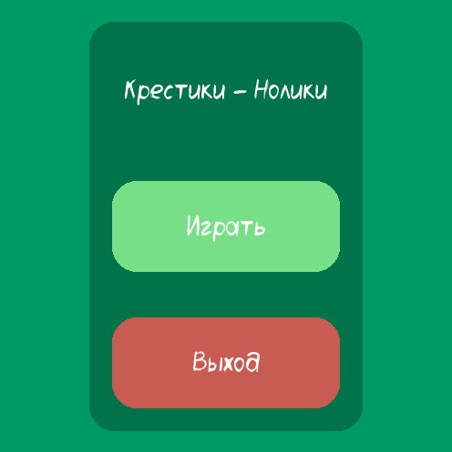
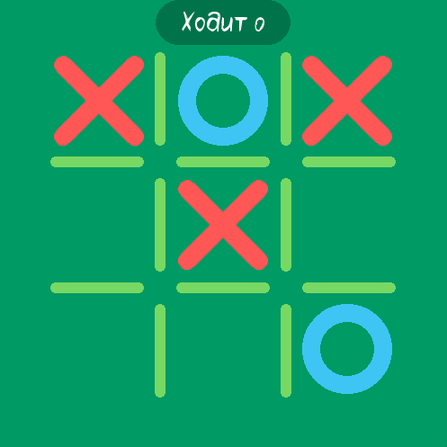
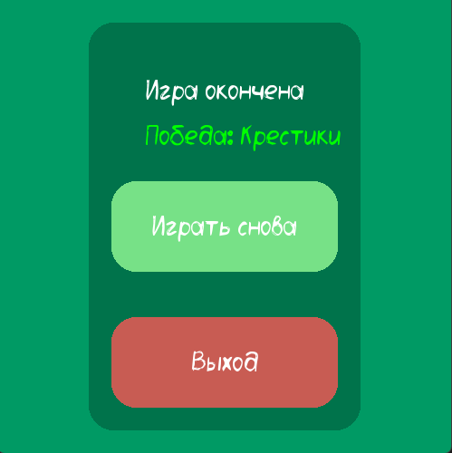

# NoughtsAndCrosses
Крестики-Нолики с графическим интерфейсом.
Игра была сделана в целях проекта.

Графический интерфейс - Коротаев Лев

Логика игры - Арсений Лаутермильх, Чернова Полина

О коде
---
Имеет графический интерфейс
за основу взята библиотека PyGame.
Код представляет из себя набор функций, определяющих состояние игры

 главное меню
 ___
 

 игра запущена
 ___
 

 конец игры
 ___
 


Запуск игры
---
Для старта необходимо проделать некоторые действия

* скачать файлы с репозитория, открыть консоль и прописать следующее
```
cd "Путь к скачанным файлам"
```

* Установить необходимые библиотеки, в нашем случае это PyGame
```
pip install pygame
```

* Запустить игру
```
py main.py
```